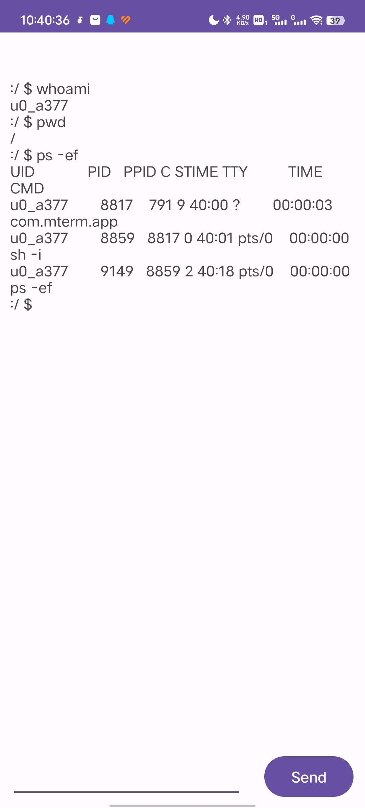

# libmterm

**A mini pseudo-terminal implementation library.**

&#x1F6E0; Warning : This is a work in progress...

## Usage

### API

```c++
    int CreateMterm
    (
        const char* cmd,
        const char* cwd,
        char* const argv[],
        char** envp,
        unsigned short rows,
        unsigned short cols
    );
    int CreateMtermDefault();
    int DestroyMterm(unsigned int id);
    int ReadMterm(unsigned int id, char* buf, unsigned long size);
    int WriteMterm(unsigned int id, const char* buf, unsigned long size);
    int WaitMterm(unsigned int id);
    void SetReadNonblockMterm(unsigned int id);
    void SetWindowSizeMterm(unsigned int id, unsigned short rows, unsigned short cols);
    bool CheckRunningMterm(unsigned int id);
```

### CXX

See
[/example/cxx](/example/cxx) for details.

```c++
#include <string.h>
#include <unistd.h>
#include <fcntl.h>
#include <termios.h>
#include <thread>
#include "libmterm.h"

int main(void)
{
    int id = CreateMtermDefault();
    std::thread readT([id] {
        SetReadNonblockMterm(id);
        char buf[4096];
        int res;
        while (true)
        {
            res = ReadMterm(id, buf, sizeof(buf));
            if (res > 0)
                write(1, buf, res);
            std::this_thread::sleep_for(std::chrono::milliseconds(1));
        }
        });

    std::thread writeT([id] {
        // stdin nonblock read
        fcntl(0, F_SETFL, O_NONBLOCK | fcntl(0, F_GETFL));
        // close echo and set canonical mode
        struct termios oldSettings, newSettings;
        tcgetattr(0, &oldSettings);
        newSettings = oldSettings;
        newSettings.c_lflag &= ~(ICANON | ECHO);
        tcsetattr(0, TCSANOW, &newSettings);

        char buf[4096];
        int res;
        while (true)
        {
            res = read(0, buf, sizeof(buf));
            if (res > 0)
                WriteMterm(id, buf, res);
            std::this_thread::sleep_for(std::chrono::milliseconds(1));
        }
        });
    readT.join();
    writeT.join();
    return 0;
}
```

### JAVA

See
[/example/java](/example/java) for details.

1. simple demo with maven

```java
package com.mterm.lib;

import java.io.IOException;
import java.io.InputStream;
import java.util.concurrent.TimeUnit;

public class Main {
    public static void main(String[] args) throws InterruptedException {
        int id = JNI.createMtermDefault();
        Thread readThread = new Thread(() -> {
            JNI.setReadNonblockMterm(id);
            byte[] buffer = new byte[4096];
            int res;
            try {
                while (true) {
                    res = JNI.readMterm(id, buffer, buffer.length);
                    if (res > 0) {
                        System.out.write(buffer, 0, res);
                        System.out.flush();
                    }
                    TimeUnit.MILLISECONDS.sleep(1);
                }
            } catch (InterruptedException e) {
                e.printStackTrace();
            }
        });

        Thread writeThread = new Thread(() -> {
            try {
                InputStream stdin = System.in;
                byte[] buffer = new byte[4096];
                int res;
                while (true) {
                    res = stdin.read(buffer);
                    if (res > 0) {
                        JNI.writeMterm(id, buffer, res);
                    }
                    TimeUnit.MILLISECONDS.sleep(1);
                }
            } catch (IOException | InterruptedException e) {
                e.printStackTrace();
            }
        });

        readThread.start();
        writeThread.start();

        readThread.join();
        writeThread.join();
    }

}
```

2.mterm_android_demo



### RUST

See
[/example/java](/example/rust) for details.

```rust
use core::panic;
use libmterm_rs::*;
use std::{
    io::{self, Write},
    time::Duration,
};

fn main() {
    let id = create_default();
    if id < 0 {
        panic!("failed to create terminal");
    }

    // read
    let read_id = id.clone() as u32;
    let read_thread = std::thread::spawn(move || {
        libmterm_rs::set_read_nonblock(read_id);
        let mut res;
        loop {
            res = libmterm_rs::read(read_id);
            if res.len() > 0 {
                print!("{}", res);
                io::stdout().flush().expect("Failed to flush stdout.");
            }
            std::thread::sleep(Duration::from_millis(1));
        }
    });

    // write
    let write_id = id.clone() as u32;
    let write_thread = std::thread::spawn(move || loop {
        let mut buf = String::new();
        std::io::stdin()
            .read_line(&mut buf)
            .expect("Failed to read line");
        libmterm_rs::write(write_id, buf);
    });

    read_thread.join().unwrap();
    write_thread.join().unwrap();
}
```
